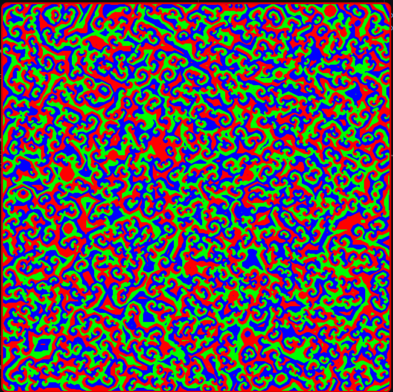

This project is just a fun little visualization I made while learning Rust. I might come back to this to revise code as I get better with Rust.

To compile and run:
```bash
cargo run --release
```
This code implements a Rock-Paper-Scissors cellular automaton simulation with a graphical interface using SDL2. Here's what it does:

1. Creates a grid where each cell is randomly initialized as either Rock (green), Paper (red), or Scissors (blue)
2. Each cell interacts with its 8 neighbors according to Rock-Paper-Scissors rules:
   - Paper beats Rock
   - Rock beats Scissors
   - Scissors beats Paper
3. If a cell is surrounded by 3 or more of its "predator" type, it changes to that type
4. The simulation runs continuously, creating patterns and showing the competition between the three types
5. Renders the simulation in real-time using SDL2, with each pixel representing one cell

It's essentially a visual representation of evolutionary competition between three species, where each type can dominate another but is vulnerable to the third type, creating interesting dynamic patterns.

The below image shows what the visualisation should look like after running for about a minute


